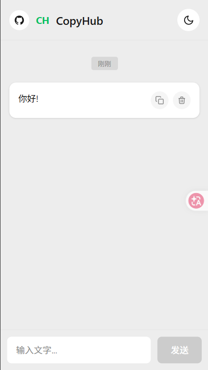
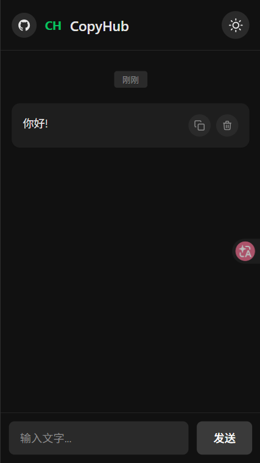

# CopyHub

一个轻量级的多人协作剪贴板工具。

## 界面展示




## 快速开始

### Docker 一键部署

```bash
docker compose up -d
```

访问 http://localhost:12500 即可使用。

### 本地开发

```bash
# 后端
cd backend
pip install -r requirements.txt
uvicorn main:app --reload --port 8000

# 前端
cd frontend
npm install
npm run dev
```

前端访问地址: http://localhost:5173

## 功能特性

- **实时同步** - 基于 WebSocket，多客户端消息实时更新
- **深色模式** - 自动跟随系统，一键切换主题
- **轻量简洁** - 无需安装客户端，打开浏览器即可使用
- **跨设备同步** - 不同设备之间快速传递文本内容
- **一键部署** - 支持 Docker 快速部署

## 技术栈

| 类型 | 技术 |
|------|------|
| 前端 | Vue 3 + Vite + Tailwind CSS |
| 后端 | FastAPI + SQLite |
| 实时通信 | WebSocket |
| 部署 | Docker + Nginx |

## 项目结构

```
CopyHub/
├── frontend/                # Vue 3 前端项目
│   ├── src/
│   │   ├── App.vue          # 主应用组件
│   │   └── components/      # 组件目录
│   ├── Dockerfile
│   └── nginx.conf           # Nginx 配置
├── backend/                 # FastAPI 后端项目
│   ├── main.py              # API 路由 + WebSocket
│   ├── models.py            # 数据模型
│   ├── database.py          # 数据库配置
│   └── Dockerfile
├── img/                     # 截图
├── docker-compose.yml       # Docker 编排文件
└── data/                    # SQLite 数据持久化目录
```

## API 接口

| 方法 | 路径 | 说明 |
|------|------|------|
| GET | /api/items | 获取所有剪贴板内容 |
| POST | /api/items | 新增剪贴板内容 |
| DELETE | /api/items/{id} | 删除指定内容 |
| WebSocket | /ws | 实时消息推送 |

## License

MIT